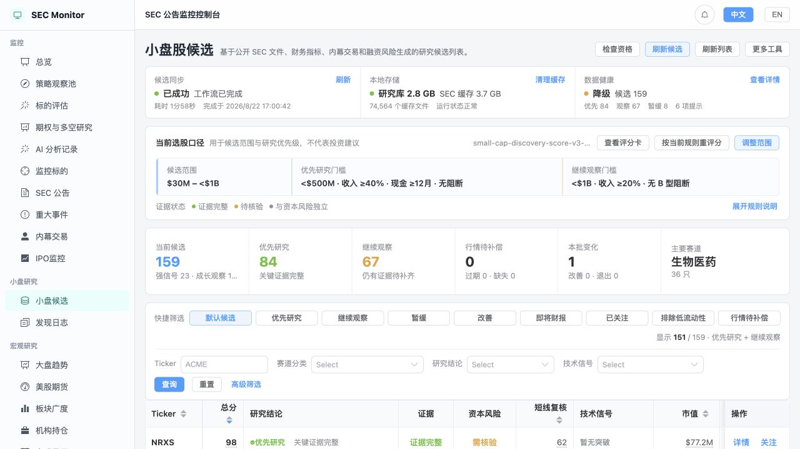
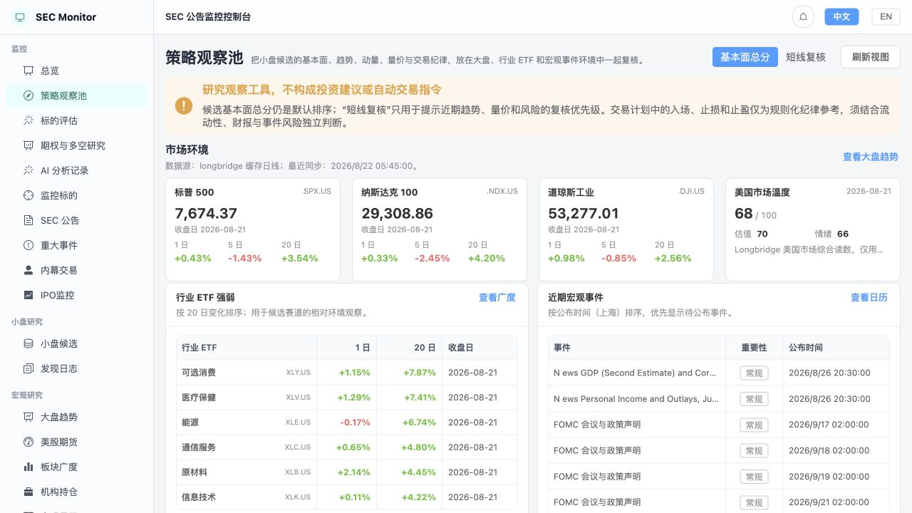
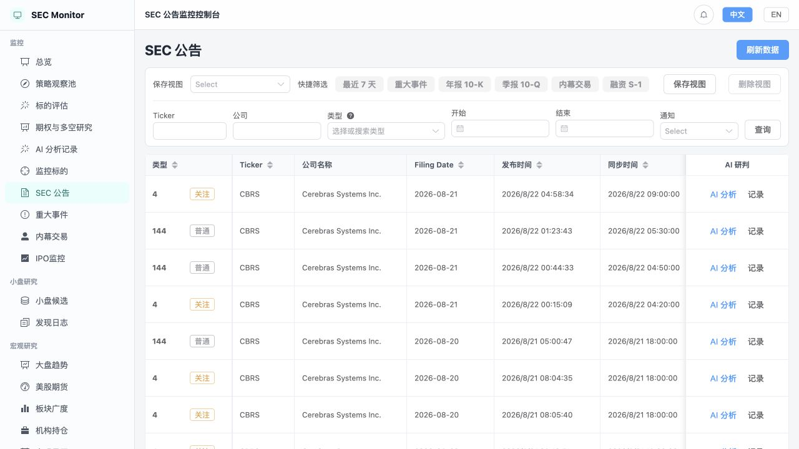
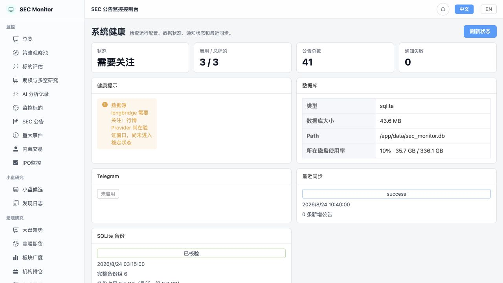

# SEC Monitor

<p align="center">
  <a href="https://github.com/jiangbo202/SEC_Monitor/blob/main/LICENSE"></a>
  <a href="https://github.com/jiangbo202/SEC_Monitor/stargazers"></a>
  <a href="https://github.com/jiangbo202/SEC_Monitor/releases"></a>
  
  
</p>

<p align="center">
  <a href="./README.md">简体中文</a> ·
  <a href="./README.en.md">English</a> ·
  <a href="https://github.com/jiangbo202/SEC_Monitor/releases">版本发布</a> ·
  <a href="https://github.com/jiangbo202/SEC_Monitor/issues">问题反馈</a> ·
  <a href="https://github.com/jiangbo202/SEC_Monitor/pulls">Pull Requests</a>
</p>

本地优先的美股研究与 SEC 情报工作台。它把公告、监控标的、IPO、宏观数据、小盘候选、机构持仓和手动 AI 研判沉淀到本地 SQLite，便于持续复核；不构成投资建议，也不自动交易。

> **安全边界：local-first、无内置认证、不要公网裸露部署。** Docker 默认仅绑定 `127.0.0.1:9090`。如需远程访问，请通过 VPN 或已配置登录、TLS 与访问控制的反向代理，不要直接暴露应用端口。

> 项目包含 AI 辅助生成的代码。用于真实资金或对外生产环境前，请自行完成安全、合规和数据质量审查。

## 项目特点

- **证据优先，而不是只给分数**：SEC 原文、行情、财务、资本风险、技术指标和研究结论分层保存；评分可以解释、复算和回溯。
- **面向研究流程，而不是自动交易**：候选发现、证据补齐、短线复核、策略观察和交易纪律各自独立，研究员可以从异常阶段继续处理。
- **本地快照驱动**：详情与列表优先读取已同步数据，打开页面不会临时请求行情或 AI 服务，减少等待、额度消耗和结果漂移。
- **失败隔离与可恢复**：同步按数据源、批次和标的拆分；单个标的失败不会拖垮整批任务，并保留重试检查点、退避时间与质量事件。
- **真实暴露数据质量**：缺失、过期、来源冲突、样本不足和基准未就绪会进入健康报告，不会被默认值伪装成正常数据。
- **人工可控的 AI 辅助**：AI 只在用户手动触发时运行，并保存模型、提示词版本、输入快照、结果、耗时和失败原因。

## 页面预览

以下截图来自 Docker 本地环境中的真实数据，用于展示界面与研究流程；其中的证券、分数和状态不构成投资建议。

### 小盘股候选：从数据健康到研究结论

候选同步、筛选口径、证据状态、资本风险、技术信号与研究结论集中在同一页面；范围与规则可调整，历史价格缺口可按标的重试。



### 策略观察池：把个股放回市场环境

结合大盘指数、市场温度、行业 ETF 强弱和宏观事件复核候选，避免只依据单一总分做判断。



<table>
  <tr>
    <td width="50%"><strong>SEC 公告检索与 AI 研判入口</strong></td>
    <td width="50%"><strong>系统健康、备份与同步状态</strong></td>
  </tr>
  <tr>
    <td></td>
    <td></td>
  </tr>
  <tr>
    <td>按表单类型、日期、公司和通知状态检索；从本地记录进入原始公告或手动 AI 分析。</td>
    <td>集中显示数据源、数据库、同步、通知和备份状态，让降级与待处理问题可见。</td>
  </tr>
</table>

## 能做什么

- **监控标的与 SEC 公告**：管理股票/ETF，增量同步 EDGAR 文件，查看重大事件、内幕交易、财报预告与发布，并按条件发送通知。
- **IPO 监控**：跟踪 S-1/F-1、EFFECT、424B4、RW 等生命周期文件；结合 SEC 映射和 Longbridge 二次核验上市状态，支持关注公司及进展通知。
- **小盘研究与策略观察池**：基于本地财务、价格、技术、流动性与交易纪律快照筛选候选，保留评分、变化原因、交易计划和历史效果。
- **标的评估**：输入股票或 ETF 后复用已有研究逻辑，输出基本面、短线复核、趋势/动量、量价及交易纪律，并保存历史快照。
- **宏观与市场研究**：查看大盘、行业 ETF、期货、宏观日历（含非农、CPI、PPI、PCE、FOMC 等）及机构 13F 持仓变化。
- **研究补充**：保存 Longbridge 分析师共识、估值、期权研究、机构持仓与公司资料；详情页仅读取本地快照，不会因浏览页面额外调用第三方接口。
- **AI 研判**：支持多个 OpenAI 兼容提供商（含 DeepSeek）、可配置提示词模板、手动异步执行、结果/提示词/耗时审计和站内完成通知。不会自动调用第三方 AI。
- **运营与通知**：统一管理站内消息、Telegram、去重、重试、死信、任务日志、系统健康、SQLite 备份和恢复演练。

## 数据与边界

| 场景 | 主要来源 | 说明 |
| --- | --- | --- |
| 事实、公告、IPO、13F | SEC EDGAR | 业务事实的主来源 |
| 行情、公司资料、共识、估值、期权 | Longbridge，可配置 Tiingo / Twelve Data / Yahoo 回退 | 结果先写入本地快照 |
| 宏观日历 | BEA、BLS、FRED、Fed、Treasury、Census、DOL、EIA | BLS 暂不可用时可由 FRED 的 BLS 镜像回填；页面会标记为“数据期” |
| AI 研判 | 用户配置的 OpenAI 兼容 API | 仅在页面手动触发时调用 |

系统不会把商业平台的预测、评级或“利多/利空”标签当作 SEC 官方事实；数据缺失会明确显示，而不会填造结论。

## 四层研究数据架构

数据沿单向链路进入研究结论，低层事实不会被高层评分或人工观点覆盖：

```text
原始来源（Raw） → 标准事实（Fact） → 派生指标（Feature） → 研究结论（Decision）
 SEC / 行情响应     OHLCV / 公告 / 股本      RSI / KDJ / 增长率        候选评分 / 研究状态
 抓取时间与版本     来源、日期、质量状态      计算版本与输入批次         规则版本与决策依据
```

- **Raw**：保留来源版本、抓取时间、哈希和提供方原始证据。
- **Fact**：把公告、证券、OHLCV、股本和财务观察标准化，并记录 `as-of` 与质量状态。
- **Feature**：从事实可重复计算技术、基本面、估值和市场质量指标，不反向改写事实。
- **Decision**：保存候选评分、研究准备度、信号事件和交易计划状态，并关联输入批次与规则版本。

来源冲突或数据不完整时，系统会隔离受影响实体并创建质量事件；其他标的继续处理，后续成功重试可自动关闭事件。详细约束见 [研究数据四层架构](docs/architecture/data-layers.md)。

## 快速开始

### Docker（推荐）

前置条件：Docker 与 Docker Compose v2。

```bash
# 生成并写入本地 .env；不要提交此文件
openssl rand -base64 32

# 启动（会构建前后端）
make docker-up
```

访问：<http://127.0.0.1:9090>

健康检查：<http://127.0.0.1:9090/healthz>

首次打开后，在“系统配置”完成：

1. 配置明确的 SEC User-Agent（例如 `SEC Monitor your-email@example.com`）。
2. 配置 `CONFIG_ENCRYPTION_KEY`，用于加密 Telegram、Longbridge、价格源和 AI 密钥。
3. 按需填写 Longbridge / Tiingo / Twelve Data / AI Provider 凭据。
4. 添加监控标的，并在“调度任务”检查启用的任务与运行时间。

`.env` 示例：

```env
CONFIG_ENCRYPTION_KEY=<openssl rand -base64 32 的输出>
SEC_USER_AGENT=SEC Monitor your-email@example.com
```

不要丢失或随意轮换已在使用的加密密钥，否则历史加密配置无法解密。

### 本地开发

前置条件：Go 1.25+、Node.js 20+、npm。Go 1.24+ 在默认自动工具链设置下会按 `go.mod` 下载并使用 Go 1.25；也可自行安装 Go 1.25。

```bash
make start      # 后端 :8080，前端 :5173
make status
make logs
make stop
```

## 常用命令

```bash
# Docker
make docker-up
make docker-logs
make docker-down

# 小盘研究（Docker）
make docker-discovery-sync
make docker-discovery-incremental-sync
make docker-discovery-market-sync

# 测试与构建
go test ./...
cd web && npm run build
```

`make docker-up` 会停止本地开发服务，再启动 Docker 容器。`docker compose down` 保留数据库卷；`docker compose down -v` 会删除所有 Docker 数据，操作前请确认已备份。

## 使用建议

1. 先添加少量监控标的，完成一次 SEC 同步并核对结果。
2. 配置行情源后运行小盘研究或标的评估；缺少的价格/基本面证据会保留为待补齐状态。
3. 在“调度任务”按北京时间配置自动刷新；每项任务独立运行，不会因为某项失败阻塞其他数据源。
4. 在“系统健康”“同步历史”“通知日志”处理失败、重试与备份容量告警；避免频繁手动重跑额度敏感的行情或 AI 任务。
5. AI 仅作为研究辅助：先在详情页选择模型和模板手动执行，再结合原始 SEC 文件与本地证据判断。

## 运行与数据存储

- 默认数据库：`data/sec_monitor.db`；小盘研究使用独立 SQLite 库。
- Docker 数据保存在命名卷 `sec_monitor_sec-monitor-data`，容器内路径为 `/app/data`。
- 本地运行日志默认位于 `logs/YYYY-MM-DD/`；Docker 日志通过 `make docker-logs` 查看。
- SQLite 备份、恢复演练、数据库整理和历史清理由系统配置与调度任务统一管理。清理前会预览，备份任务会校验完整备份组。
- 同步、通知和 AI 调用均保留本地状态与脱敏错误，便于审计和排障。

## 安全

- 不要提交 `.env`、数据库、备份、日志、Token 或 API Key。
- 配置接口只返回脱敏密钥；敏感配置在数据库中加密保存。
- AI、Longbridge、Telegram 和价格源请求均可能产生费用或额度消耗，请使用预算、调度和手动触发控制。
- 备份默认仍在本机/本地 Docker 卷；如需灾备，请自行配置受控的异地备份流程。

## 项目结构

```text
cmd/                服务与研究同步入口
internal/api/       Gin 路由与处理器
internal/service/   业务、调度、通知与研究逻辑
internal/sec/       SEC EDGAR 客户端与解析
internal/model/     GORM 模型
web/                Vue 3 前端
docs/               详细设计、API 与运维文档
```

详细资料请查阅 [docs](docs/)；备份与恢复边界见 [docs/operations/backup-and-recovery.md](docs/operations/backup-and-recovery.md)。

## 反馈与贡献

- 发现问题或有功能建议，请提交 [Issue](https://github.com/jiangbo202/SEC_Monitor/issues)。
- 欢迎提交 [Pull Request](https://github.com/jiangbo202/SEC_Monitor/pulls)，请先阅读 [贡献指南](CONTRIBUTING.md)。
- 安全漏洞请勿公开提交 Issue，按 [安全策略](SECURITY.md) 私密报告。

## 许可证

[MIT License](LICENSE)
