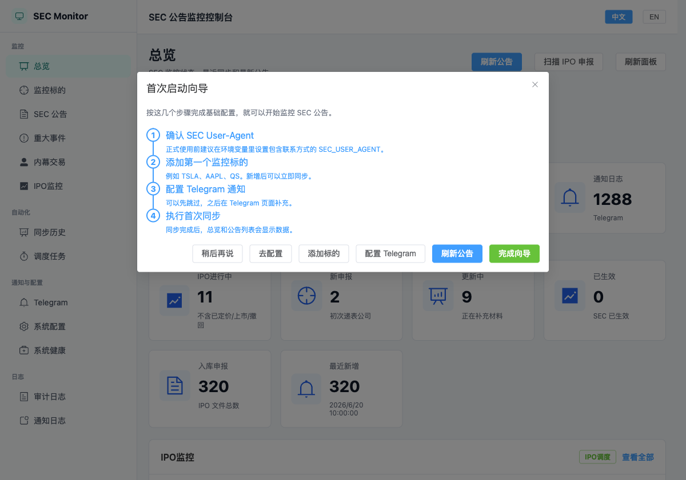
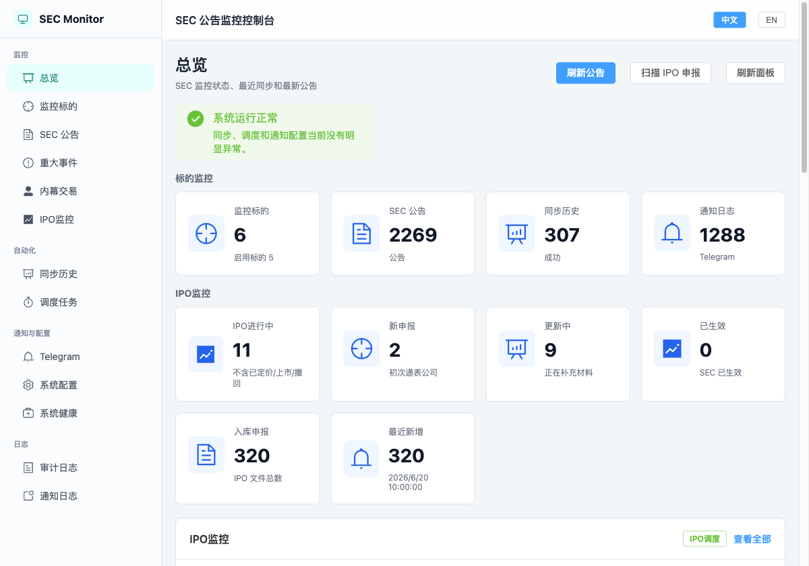
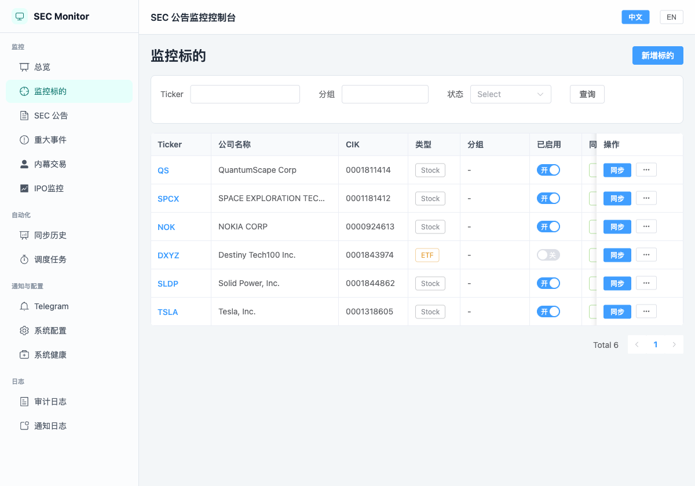
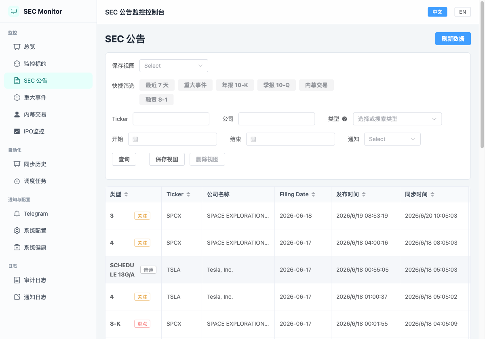
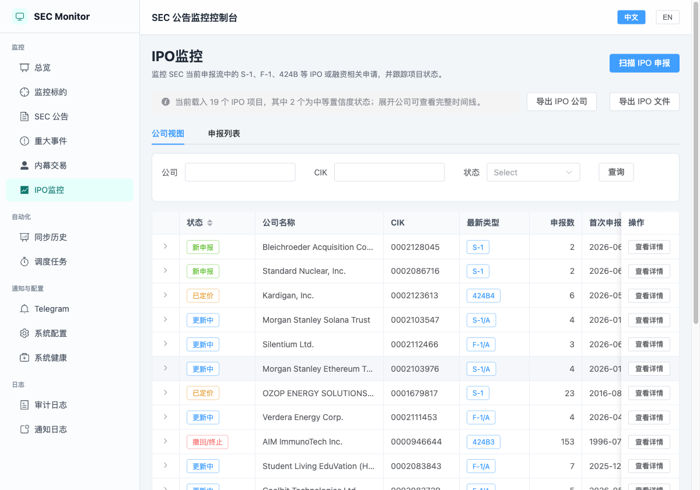
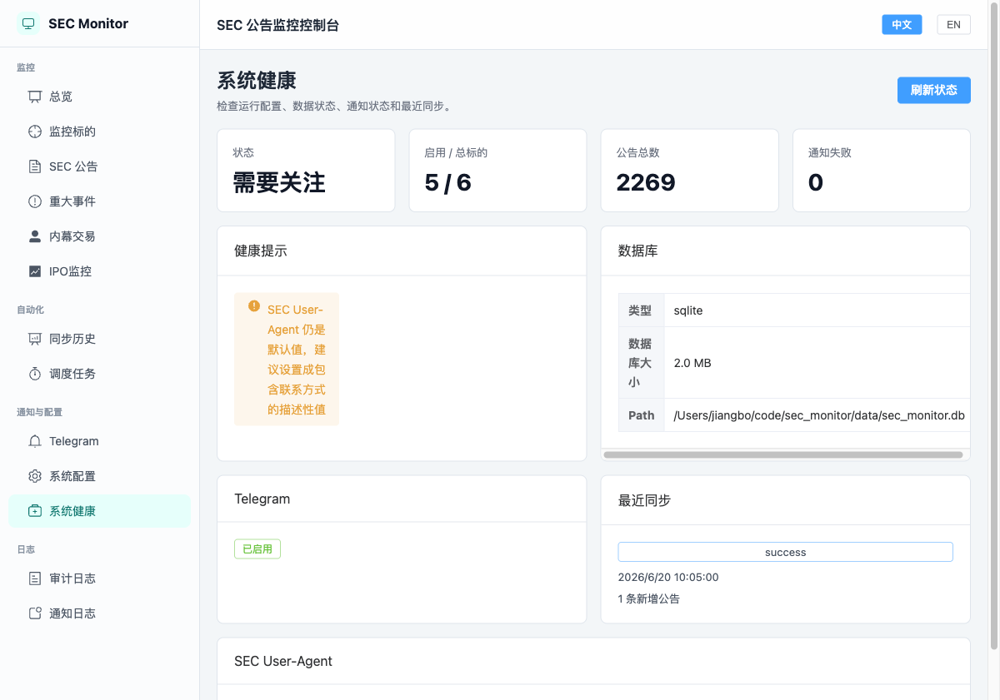
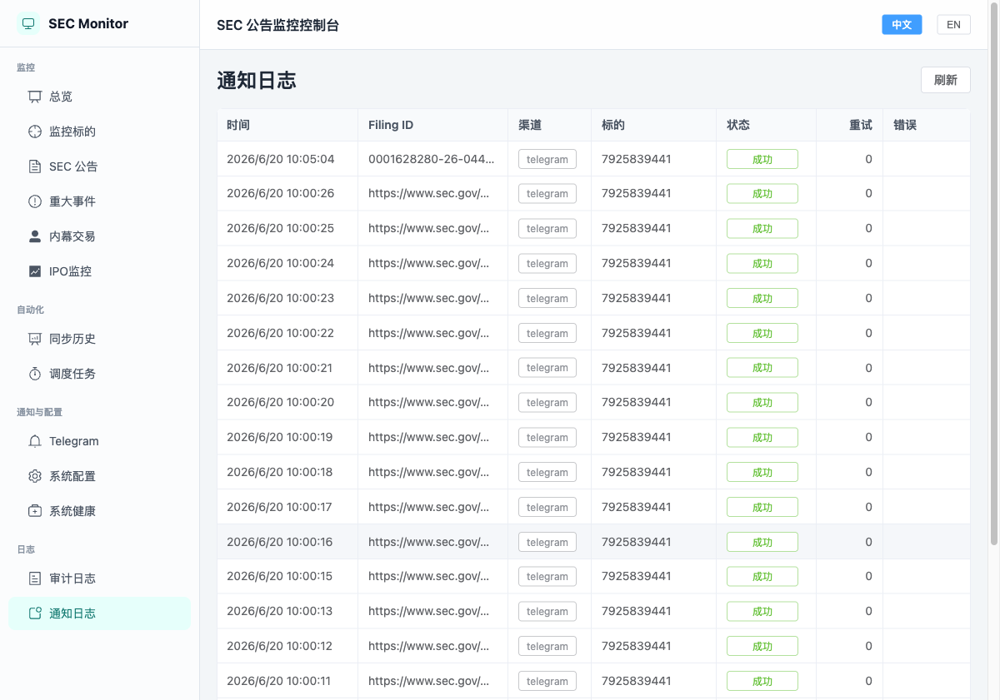
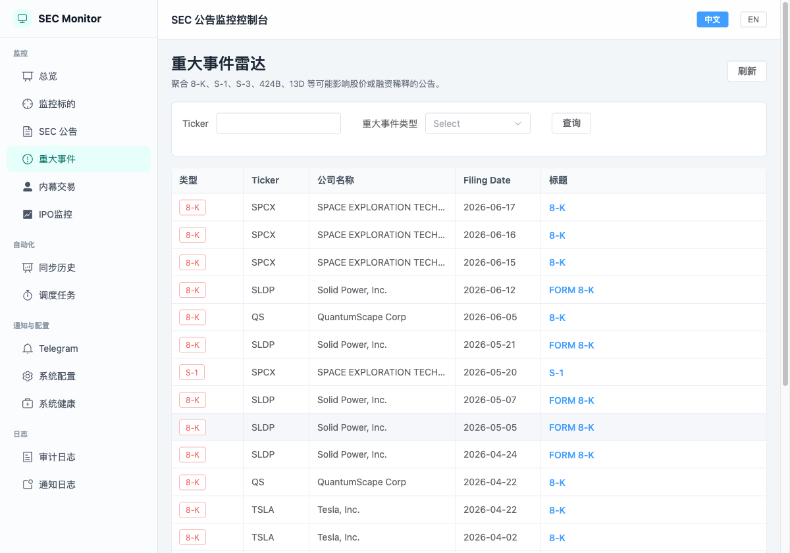
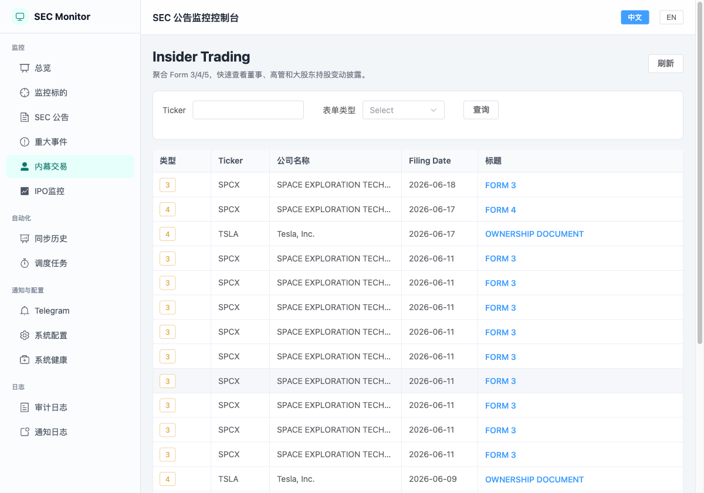

# SEC Monitor 用户体验与产品完整度评估

评估日期：2026-06-20

## 评估范围

本次从关注美股标的用户的主要路径出发，检查：

1. 进入系统并理解运行状态。
2. 管理监控标的。
3. 查找最新 SEC 公告。
4. 识别重大事件。
5. 查看内幕交易。
6. 跟踪 IPO 公司。
7. 确认通知送达和系统健康。

证据来自本地应用 1200 x 840 桌面视口及当前 SQLite 数据：

- 6 个监控标的
- 2,269 条 SEC 公告
- 320 条 IPO 文件
- 307 次同步记录
- 1,288 条通知记录

## 总体结论

SEC Monitor 已经是一套可实际使用的本地 SEC 数据采集与提醒工具。标的管理、增量同步、调度、筛选、IPO 聚合、Telegram、导出、清理、审计日志和健康检查均已形成完整基础。

它还不是完整的美股情报和决策辅助产品。当前多数高关注页面仍在展示公告元数据，尚未充分回答“发生了什么、为什么重要、我下一步要看什么”。综合判断：

- 作为本地 SEC 监控工具：约 **7/10**。
- 作为投资信息决策辅助工具：约 **5/10**。

## 用户路径

### 步骤 1：首次进入与启动向导 - 需要改进

向导内容直接，也提供了明确操作。但当前数据库已经有 6 个标的、数千条公告、成功同步和 Telegram 历史，向导仍然弹出。应根据必要配置是否已经完成自动判断，或可靠保存“稍后/完成”状态，避免把长期用户当成新用户。

### 步骤 2：总览 - 基本健康

标的监控和 IPO监控分区清楚，同步健康也容易理解。它能很好回答“系统是否运行”，但不能快速回答“今天什么事情需要我处理”。当前缺少未读数量、优先事件队列、公告摘要和待处理异常。2,269 条公告、1,288 条通知等累计数字占据首屏，但对日常决策帮助有限。

### 步骤 3：监控标的 - 功能完整，优先级能力不足

Ticker 查询、启停、立即同步和行操作构成了完整基础流程。分组字段已经存在，但当前没有体现标的优先级、持仓状态、关注理由、个性化提醒规则或用户备注。表格横向字段较多，固定操作列压缩了同步状态等关键信息。

### 步骤 4：SEC 公告 - 检索能力强，筛选决策弱

筛选、保存视图、日期、类型搜索和排序都比较实用。但首屏主要显示类型和日期，标题及事件含义需要横向滚动后才能看到。虽然有重点、关注、普通标签，但用户无法直接看出评级依据和事件摘要。

### 步骤 5：IPO监控 - 当前最有差异化的功能

按公司聚合、生命周期状态、文件数量、最新类型、时间线和手动校准，比单纯的 EDGAR 文件列表更有价值。尚缺市场结果闭环：已验证的上市状态、最终 Ticker、交易所、发行价、预计/实际上市日期、撤回原因和数据来源时间。

### 步骤 6：系统健康 - 检查有价值，状态不一致

数据库、Telegram、最近同步和配置检查都很有用。但健康页因为 SEC User-Agent 仍为默认值而显示“需要关注”，总览却显示“系统运行正常”。两个页面应共用一套健康判断。User-Agent 警告被挤压成很窄的纵向文字块，也不利于阅读和处理。

### 步骤 7：通知日志 - 能送达，但缺少注意力管理

状态和重试次数清楚。数据库记录显示，2026-06-05 有 903 条成功通知，2026-06-16 有 356 条成功通知。页面无法解释这些通知属于哪个同步批次、是否为历史补齐、涉及多少个不同公司或事件，也没有未读、确认、归档、静音、稍后处理、摘要和批次聚合。

### 步骤 8：重大事件雷达 - 目前主要是表单类型筛选

页面能集中展示高关注表单，但多数标题仍只是“8-K”或“FORM 8-K”。系统尚未提取 8-K Item、事件分类、融资规模、持股变化或重要性原因。“雷达”这个名称承诺了事件解释能力，而当前更接近预设类型过滤器。

### 步骤 9：内幕交易 - 能发现文件，不能直接理解交易

Form 3/4/5 已经能稳定聚合，但用户仍要打开 SEC 原文才能知道交易人、职位、买入/卖出、数量、价格、金额、交易代码和交易后持股。补齐结构化解析后，这个页面才会成为真正的内幕交易监控工具。

## 当前优势

- 本地优先加 SQLite，部署简单，数据归用户所有。
- 数据拉取、去重、调度、历史、重试和健康检查基础完整。
- Ticker 自动查询和立即同步降低了新增标的成本。
- 公告筛选、保存视图、排序和 SEC 原文链接支持深入调查。
- IPO 公司聚合和生命周期推断已经超越原始 EDGAR 文件流。
- Telegram、审计日志、清理预览、导出与备份增强了长期运行能力。
- 中英文切换提升了使用范围。

## 优先级建议

### P0：让提醒可信、可控、可处理

1. 默认不通知首次历史导入和明确执行的历史补齐。
2. 增加每次同步的通知摘要、速率限制，以及即时/摘要模式。
3. 增加提醒收件箱：未读、已确认、已归档、静音、稍后处理。
4. 将同一事件的原始文件和修订稿聚合为一个事件线程。
5. 显示每条提醒的命中原因：表单类型、关键词、标的规则或重要性规则。

验收目标：一次普通同步只产生少量、可解释、可处理的提醒，而不是数百条独立消息。

### P0：从 SEC 文件中提取“事件含义”

1. 8-K：解析 Item 编号，并映射为业绩、管理层变动、融资、并购、破产、审计师变更等事件。
2. Form 4：展示交易人、职位、买卖方向、数量、价格、金额、交易代码和交易后持股。
3. Schedule 13D/13G：展示申报人、持股比例、变化幅度和潜在主动投资意图。
4. 10-K/10-Q：提取 XBRL 核心指标和同比/环比变化。
5. 优先提供确定性的结构化摘要和“为何重要”，再考虑可选 AI 摘要。

验收目标：用户无需打开 SEC 原文即可完成大多数公告的第一轮筛选。

### P0：统一健康状态和数据时效

1. 总览和系统健康共用同一套状态计算。
2. 按数据源和标的显示：上次尝试、上次成功、预计下次执行和过期阈值。
3. 必要配置完成后自动结束首次启动向导。
4. 将 SEC 限流、部分失败和调度延迟显示为可处理告警。

### P1：增加“公司情报工作台”

为每个标的提供统一详情页，整合：

- 关注优先级、分组、标签、备注和可选持仓状态。
- 公告时间线及其修订关系。
- 重大事件和解析后的内幕交易。
- 当前提醒规则及最近送达状态。
- 数据新鲜度和同步历史。

它应成为回答“TSLA 最近发生了什么”的主要入口，避免用户在多个全局列表之间跳转。

### P1：让提醒规则支持标的差异

在全局、分组和单标的三个层级支持：

- 表单类型和事件类别。
- 包含/排除关键词。
- 重要性阈值。
- 内幕交易金额阈值。
- 静默时间、即时提醒和摘要周期。
- 对重点关注或持仓标的覆盖全局规则。

### P1：完成 IPO 生命周期闭环

增加最终 Ticker、交易所、发行价、发行数量、预计/实际上市日期、首日交易状态和撤回原因。明确区分 SEC 文件推断状态与市场验证状态，并保留来源和更新时间。

### P1：扩展监控标的之外的发现能力

允许配置全市场事件规则，例如新 13D 主动持股、大额内部人买入、审计师辞任、破产和异常融资。IPO 全市场发现已经证明该模式可行。

### P2：增加可选市场背景

在 SEC 工作流稳定后，可选增加：

- 公告前后的价格和成交量变化。
- 财报与公司行动日历。
- 同行业/同类标的对比。
- 相关新闻链接。

市场数据应保持可选，确保没有付费数据源时仍可完整使用 SEC 核心功能。

## UX 与无障碍风险

- 宽表格隐藏高价值字段，应优先显示标题/事件摘要，并支持列配置预设。
- 多个页面混用中英文标签，影响一致性。
- 部分状态解释依赖鼠标悬停；键盘和触屏用户还需要可聚焦的详情入口。
- 密集表格的小按钮和浅色文字需要进一步验证点击尺寸与对比度。
- 系统健康警告在当前布局下会被压缩成狭窄文字列。
- 截图和 DOM 无法确认完整键盘顺序、屏幕阅读器播报、缩放重排及精确对比度，仍需专项无障碍测试。

## 推荐落地顺序

1. 历史补齐通知抑制、批次聚合、提醒收件箱和健康状态一致性。
2. 8-K 与 Form 4 结构化解析。
3. 公司情报工作台和分层提醒规则。
4. 13D/13G 与 XBRL 解析。
5. IPO 市场结果验证和全市场事件发现。
6. 可选的行情与新闻背景。

这个顺序优先提升每日使用价值，再扩展数据广度。
