# SEC Monitor 当前产品评估

评估日期：2026-09-17\
评估视角：美股交易员、基本面/事件驱动分析师\
评估方式：当前运行页面只读走查、当前数据状态核对、代码路由与自动化测试交叉验证

## 一句话结论

SEC Monitor 已经是一套可信度较高的“研究数据与事件情报基础设施”，但还不是一套足够高效的“交易决策工作台”。强项是证据链、数据质量门控、可恢复任务和研究审计；主要短板是信息优先级、跨模块决策闭环、组合视角，以及窄屏/小窗口下的表格可用性。

综合判断：

- 分析师适配度：7.8 / 10
- 中低频事件驱动交易员适配度：6.6 / 10
- 日内/执行型交易员适配度：4.5 / 10
- 数据可信与审计能力：8.7 / 10
- 当前整体产品成熟度：7.1 / 10

本项目最适合“本地优先、以 SEC 事实为锚、人工做最终判断”的研究团队；不适合直接承担实时交易终端、订单执行或高频预警职责。

## 当前数据状态

截至本次检查：

- 监控标的 6 个：DJT、RKLB、SPCX、SLDP、CBRS、TSLA。
- SEC 公告 124 条；当前通知失败 0。
- 小盘候选研究库约 7.8 GB，SEC 缓存约 3.2 GB，约 25,040 个缓存文件。
- 候选数据健康为“降级”：144 个候选使用回退行情；优先/观察候选当前显示 0。
- 3 个标的技术历史仍在等待自然样本，3 个价格周期结论滞后。
- Longbridge 的 SPCX 估值同步存在一次已达自动重试上限的服务端错误。
- IPO 监控载入 96 个项目；缺少市场映射 3、发行条款解析失败 22、生命周期核查过期 34。
- SQLite 备份已校验，完整备份组 8，最近本地与副本恢复演练均通过。

这些状态说明：SEC 与监控链路正常，但候选交易链路当前不宜形成新计划。系统已经正确阻止不可靠数据进入交易计划，这是重要优点；同时，用户仍需要更直接地看到“哪些标的可用、哪些被排除、恢复后会发生什么”。

## 核心功能评分

| 功能域 | 交易员 | 分析师 | 当前评价 |
| --- | ---: | ---: | --- |
| 今日决策 | 6.5 | 7.0 | 有明确研究/交易门控，但缺少按收益风险与紧迫度排序的行动队列 |
| 策略观察与价格周期 | 7.0 | 7.2 | 能把候选放回市场环境，规则可解释；当前行情回退使实际可操作性受限 |
| 标的研究台 | 7.2 | 8.5 | 单标的证据最完整；页面过长、模块间缺少摘要与差异提炼 |
| 标的评估 | 6.8 | 7.5 | 保存可追溯快照是亮点；历史结果容易被误读为当前结论 |
| 期权研究 | 5.5 | 6.5 | 适合研究补充，不足以替代期权链、波动率曲面和持仓风险终端 |
| AI 研判 | 6.5 | 7.8 | 手动触发、保留模型/模板/输入/失败原因，边界清晰；尚未成为证据差异助手 |
| 监控标的 | 6.8 | 7.2 | 同步、技术状态、交易计划入口齐全；列表在窄窗口中丢失关键列 |
| SEC 公告与重大事件 | 7.8 | 8.6 | 来源权威、筛选完整、可直达原文；标题仍偏表单级，缺少事项级差异摘要 |
| 内幕交易与 10b5-1 | 8.0 | 8.3 | 现金交易口径严谨，能隔离非现金交易；需要异常度/历史分位与角色聚合 |
| IPO 监控 | 7.0 | 8.0 | 生命周期和异常队列很强；解析失败与核查过期数量高，需更好展示影响范围 |
| 小盘候选发现 | 6.2 | 7.6 | 规则、证据和资本风险分层好；“0 个候选”与“144 个降级”并存，解释成本高 |
| 市场/板块/期货/宏观 | 6.8 | 7.6 | 来源丰富且能区分官方与补充源；与持仓/候选的影响映射仍弱 |
| 机构持仓 | 6.3 | 7.8 | 保留报告日与来源，适合研究；需要季度变化、集中度和异常增减持摘要 |
| 通知与运行管理 | 6.5 | 8.5 | 可靠性、重试、死信、备份和审计非常成熟；内部任务名与错误信息过于工程化 |

## 主要优势

1. **拒绝伪精确。** 缺失、回退、过期、样本不足和供应商故障不会被填成正常值；当前“研究可用、暂不形成新交易计划”就是正确的风险控制。
2. **证据可回溯。** SEC 原文、同步时间、第三方来源、本地快照、AI 模型与提示词版本均可保留，适合复盘和合规审查。
3. **研究与自动交易边界清楚。** AI 手动触发，交易计划被描述为纪律参考，不直接连接券商下单。
4. **内幕交易口径专业。** 普通股公开市场 P/S 现金交易与授予、行权、转换等非现金行为分开处理，避免错误净额。
5. **IPO 与任务恢复是明显差异化能力。** IPO 生命周期、映射复核、失败队列、退避重试、恢复演练等已经超过一般个人研究工具。
6. **测试基础健康。** Go 全量测试、前端 7 个单元测试及生产构建均通过。

## 关键风险与改进建议

### P0：先解决“可决策性”

1. **把今日决策改成真正的行动队列。** 每一项应同时展示：优先级、触发原因、证据新鲜度、可交易状态、风险预算、下一动作、截止时间。当前多个“处理”按钮过于抽象。
2. **明确区分三种空状态。** “没有机会”“数据不足”“被门控排除”必须显示为三种不同结果。小盘候选当前同时出现 0 个候选和 144 个降级标的，交易员很难判断市场真的无机会，还是数据链路暂不可用。
3. **增加可用标的清单。** 当部分数据降级时，不应只给总告警；应直接列出仍满足全部门控的标的，以及每个被排除标的的唯一主因。
4. **修复窄窗口信息丢失。** 监控标的、SEC 公告、内幕交易等宽表在当前窗口只显示部分列；详情弹窗也出现横向裁切。建议在小于 900px 时切换为卡片/主次行布局，并保留 Ticker、事件、状态、时间和主要动作。
5. **把单标的详情从超长弹窗改成独立路由。** 顶部固定“结论、变化、风险、下一步”，下方使用锚点页签展示 SEC、财务、持仓、技术、AI 和研究观点；保留跨模块时间轴。

### P1：形成分析师到交易员的闭环

1. **新增“自上次复核后的变化”摘要。** 对 SEC、持仓、估值、技术、财报和 AI 只展示新增/改变的事实，避免每天重新阅读完整档案。
2. **SEC 从表单级升级为事项级。** 8-K 应优先显示 Item、金额、交易对手、股份/债务变化、是否触发模型或观点复核；10-Q/10-K 应显示关键同比/环比差异和新增风险因素。
3. **建立组合级风险中心。** 即使已有决策/成交台账，也需要在今日决策中突出当前研究仓位、成本、未实现盈亏、事件敞口、行业集中、相关性、Beta 和最大可承受损失。
4. **统一时间语义。** 所有结论都应有醒目的 `as of`、数据期、抓取时间和有效期；历史评估列表应明确标记“历史快照”，避免旧价格和旧止损被当作当前计划。
5. **把运行错误翻译成业务影响。** 例如不要首先展示 `longbridge_watch_target_valuation_sync`，而应显示“SPCX 估值缺失，不影响 SEC 与价格数据；下一次自动复核时间为……”。工程详情放在展开区。
6. **加强宏观到标的的关联。** 对未来 24 小时/7 天事件，显示受影响的候选、行业 ETF、持仓和预期波动，而不仅是独立日历。

### P2：效率与可访问性

1. 为表格提供列配置、密度切换、固定首列、导出当前筛选与跨页选择说明。
2. 统一中英文术语，例如 `Insider Trading`、`Filing Date`、`success/ready/warning` 应完整本地化或提供统一词汇表。
3. 保证图标按钮、展开按钮和省略号菜单有可见标签、键盘焦点与足够点击面积。
4. 颜色状态同时配合文字/图标，不依赖红绿；验证对比度、200% 缩放、键盘顺序与读屏表头关系。
5. 保存用户工作上下文：最近标的、筛选、排序、展开区、研究备注草稿和每日复核进度。

## 推荐的产品结构

建议把现有 25+ 个页面重组为两个主要工作模式，而不是继续增加同级导航：

- **交易员模式**：今日行动、组合风险、事件日历、预警收件箱、交易/复盘。
- **分析师模式**：标的研究、SEC/内幕/机构证据、小盘/IPO 发现、观点与版本历史。
- **运行管理**：数据健康、任务、通知、配置、备份与审计，默认折叠，仅在异常时进入。

这样不会删除现有能力，只是把“研究基础设施”从前台主导航移到合适层级，让日常决策更快。

## 走查步骤与健康度

1. **今日决策首页 — 中等。** 风险门控清楚，但行动项不够具体。\
   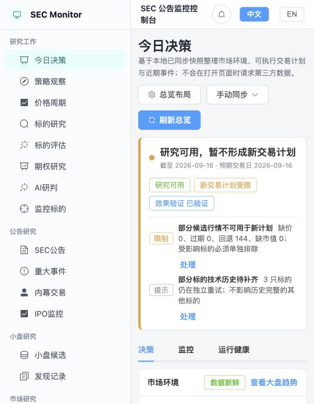

2. **策略观察池 — 中等偏好。** 能结合市场与候选，但当前数据降级限制了决策价值。\
   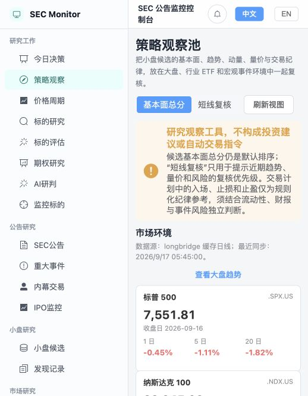

3. **小盘候选 — 中等。** 数据健康透明；候选为 0 时缺少漏斗解释。\
   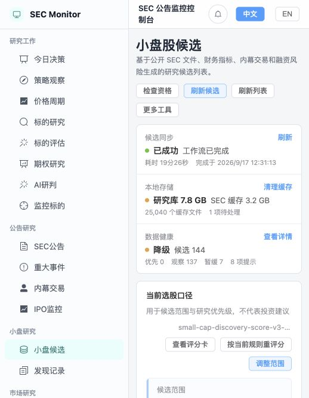

4. **监控标的 — 中等。** 当前 6 个标的均成功同步；窄窗口丢失关键列。\
   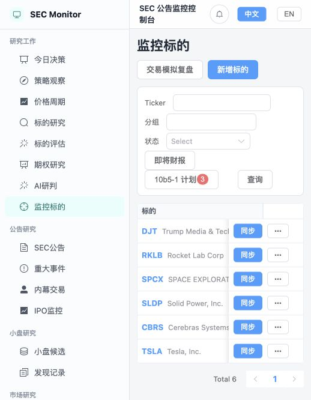

5. **DJT 标的详情 — 功能强、体验偏弱。** 证据深度高，但超长弹窗在当前窗口裁切。\
   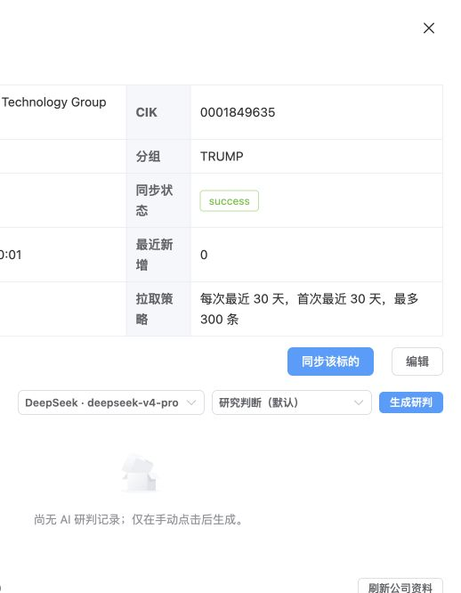

6. **SEC 公告筛选 — 良好。** 筛选、保存视图、原文与 AI 入口齐全。\
   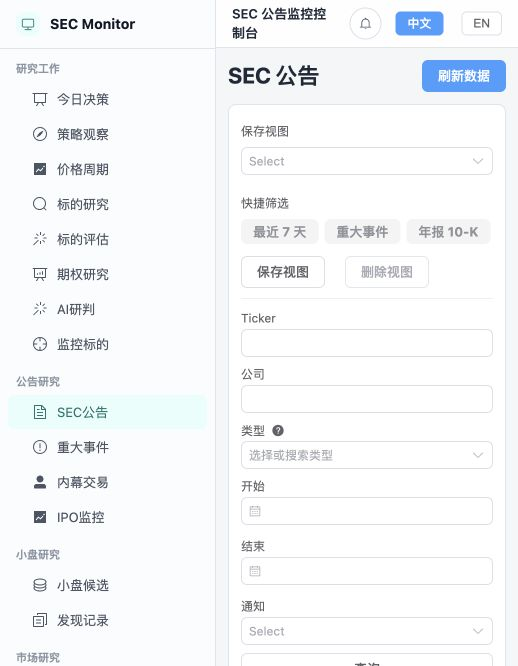

7. **SEC 公告结果 — 偏弱。** 宽表在当前窗口需要横向滚动，主体信息不可同时阅读。\
   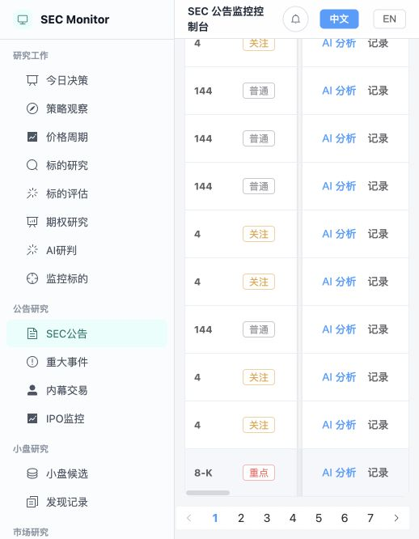

8. **系统健康 — 良好。** 6/6 标的、124 公告、通知失败 0，能正确显示“需要关注”。\
   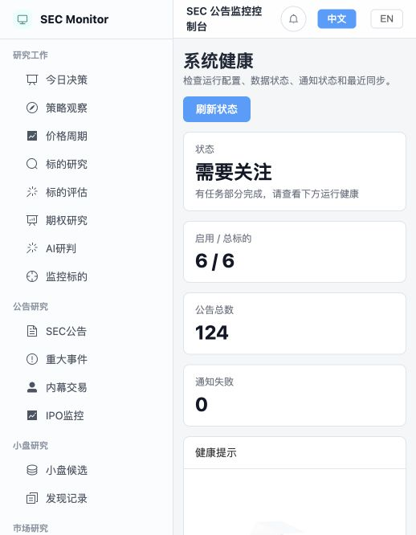

9. **今日监控 — 良好。** 汇总监控标的、IPO 与重大公告；仍需要更强的优先级和动作语义。\
   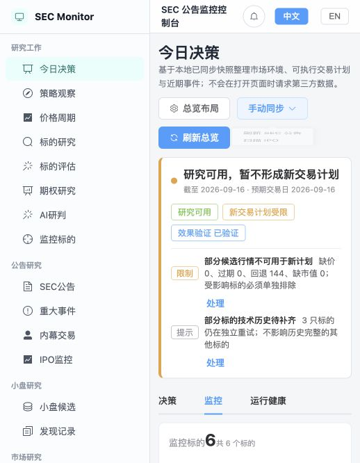

10. **今日运行健康 — 中等。** 异常可追踪，但任务名和错误文本偏工程化。\
    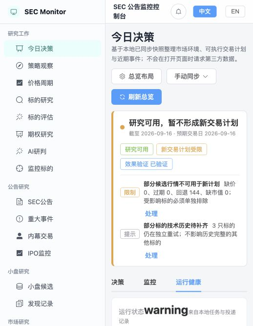

11. **内幕交易 — 良好。** 数据量和现金口径有价值，下一步应加强异常度与聚合。\
    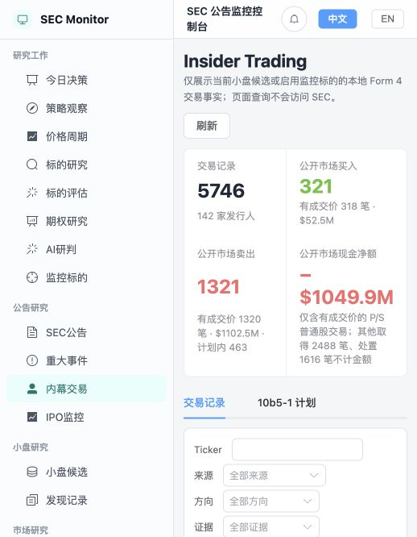

12. **IPO 监控 — 中等偏好。** 生命周期能力强，当前异常队列较大。\
    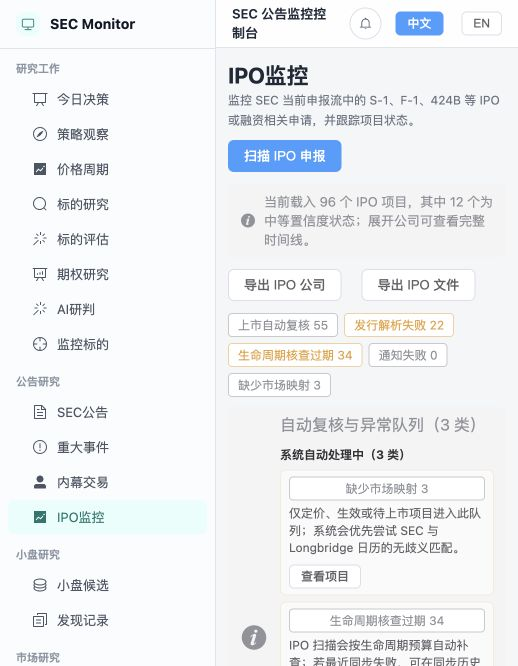

13. **宏观日历 — 良好。** 第一方与补充源分层清晰；缺少对具体标的的影响映射。\
    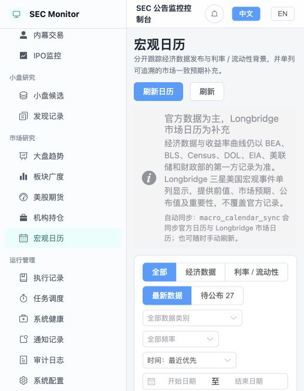

14. **标的评估 — 中等偏好。** 历史快照可追溯，但旧快照需更醒目的时效提示。\
    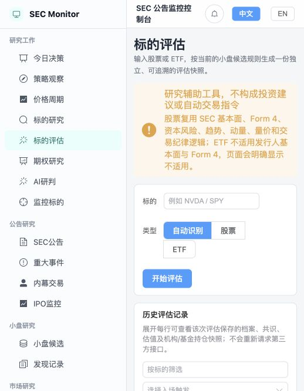

15. **AI 研判记录 — 良好。** 模型、模板、来源、耗时与失败原因齐全，符合人工辅助定位。\
    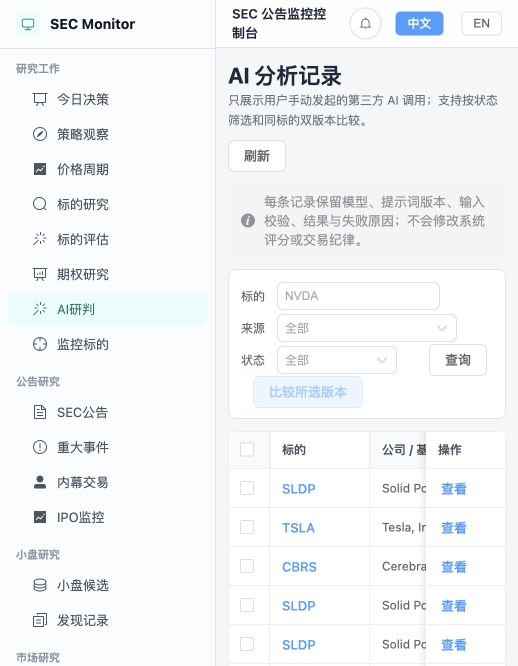

## 证据边界

- 本次为当前本地实例的只读产品走查，没有触发同步、AI 调用、通知、配置变更、删除、关注或交易模拟写入。
- 截图只能支持可见的布局、信息层级与部分可访问性风险；完整 WCAG 结论还需要键盘、读屏、对比度和响应式断点专项测试。
- 期权研究、机构持仓、通知配置等页面未逐项执行写入型主流程；对这些功能的评价同时参考了当前路由、项目说明和已保存数据结构。
- 评估不判断任何证券或交易策略本身是否值得投资。
